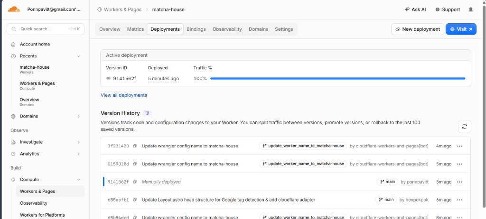
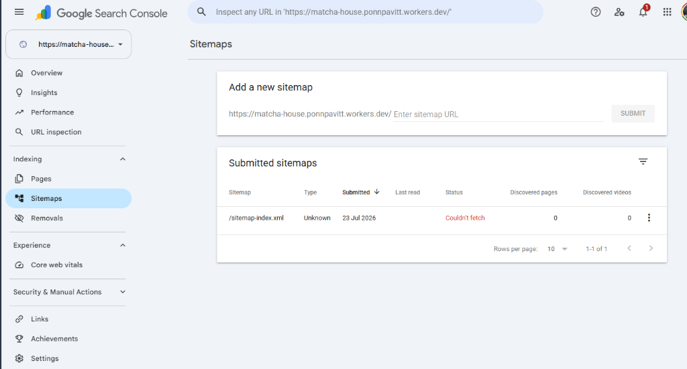
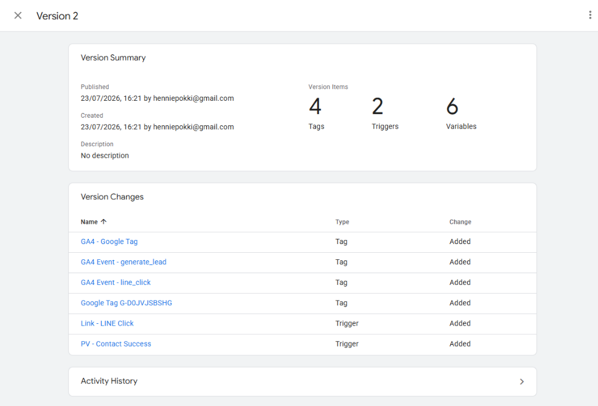
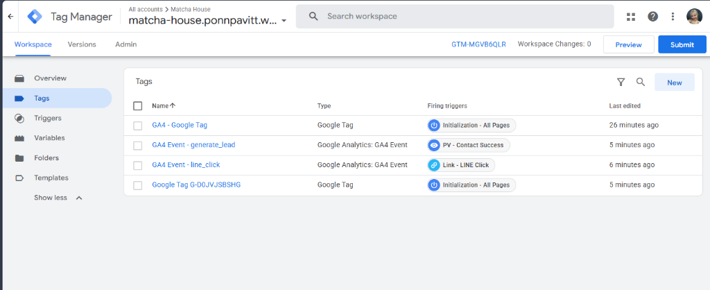
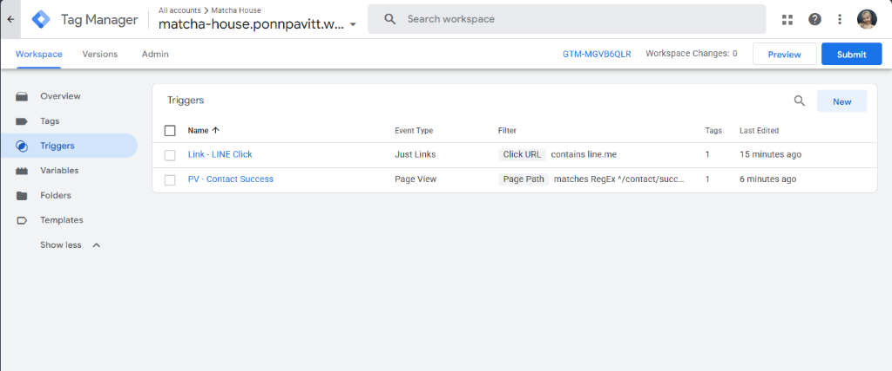

# 🍵 Zenith Matcha (Minimalist Matcha House)

> A complete, highly responsive, and SEO-optimized web platform for the premium matcha brand **"Zenith Matcha"**, built with **Astro v7**, **Tailwind CSS v4**, and **TypeScript**.

🌐 **Live Website**: [https://matcha-house.ponnpavitt.workers.dev/](https://matcha-house.ponnpavitt.workers.dev/)  
📦 **GitHub Repository**: [https://github.com/henpokpok/matcha-house](https://github.com/henpokpok/matcha-house)

---

## 📸 Production Verification & Metrics

### 1. PageSpeed Insights Performance & SEO
Achieved **100/100 SEO**, **100/100 Best Practices**, and **98/100 Accessibility** on mobile & desktop PageSpeed Insights audits.


---

### 2. Cloudflare Deployment Status
Deploys automatically to Cloudflare Workers & Pages on every commit to `main`.



---

### 3. Google Search Console & Sitemap Indexing
Sitemap configured and submitted via `https://matcha-house.ponnpavitt.workers.dev/sitemap-index.xml`.



---

### 4. Google Tag Manager (GTM) & Analytics Configuration

Container ID: `GTM-MGVB6QLR` | Measurement ID: `G-D0JVJSBSHG`

#### GTM Version 2 Published Summary


#### GTM Tags Overview
Configured GA4 Base Tag, GA4 Events (`generate_lead`, `line_click`), and Google Tag `G-D0JVJSBSHG`.


#### GTM Triggers Overview
Configured link click triggers (`Link - LINE Click`) and page view triggers (`PV - Contact Success`).


---

## 🛠️ Tech Stack & Architecture

- **Core Framework**: [Astro v7](https://astro.build/) (Static Site Generation with Cloudflare Adapter)
- **Styling**: [Tailwind CSS v4](https://tailwindcss.com/) (Organic Minimalism Design Tokens)
- **Content Engine**: Astro Content Collections API (`src/content.config.ts`)
- **Typography**: Playfair Display (Serif Headings) & Plus Jakarta Sans (Body)
- **SEO & Structured Data**: Dynamic Open Graph, Meta Keywords, and Schema.org JSON-LD

---

## 📁 Project Structure

```text
matcha-house/
├── public/
│   ├── images/docs/           # Documentation Screenshots
│   ├── robots.txt             # Search Engine Directives
│   └── google*.html           # GSC Verification File
├── src/
│   ├── components/            # SEO, Header, Footer, Gallery, ProductCard
│   ├── content/               # Products & Blog Content Collections (.md)
│   ├── layouts/               # Layout.astro with GTM & GTag Scripts
│   ├── pages/                 # Home, Catalog, Detail, Blog, Success Pages
│   └── styles/                # global.css (Tailwind Tokens)
├── content.config.ts          # Astro Content Schemas & Loaders
├── astro.config.mjs           # Sitemap & Cloudflare Adapter Config
└── tailwind.config.mjs        # Theme Specifications
```

---

## 🧞 Local Development Commands

```bash
# Install dependencies
npm install

# Start local development server
npm run dev

# Build production bundle
npm run build

# Preview build locally
npm run preview
```
